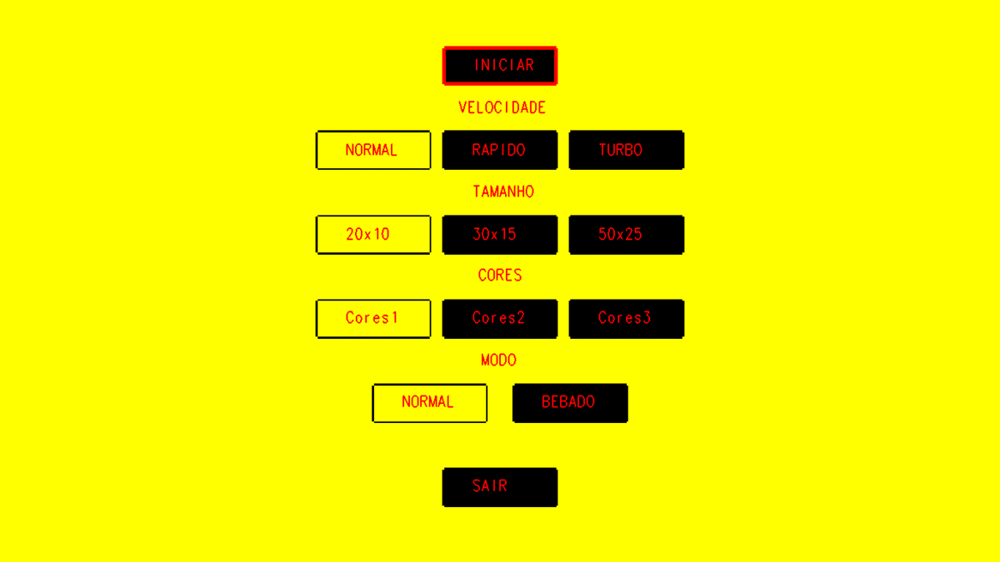

<h1 align="center">
		Tetris v1.0
</h1>

<h4 align="center">
	:hammer: Thiago Marinho Pereira
</h4>

<p align="center">


<a href="commits/master">
	
</a>

<a href="LICENSE">
		
</a>
</p>

<p align="center">
	<a href="#rocket-technologies">Technologies</a>&nbsp;&nbsp;&nbsp;|&nbsp;&nbsp;&nbsp;
	<a href="#computer-project">Project</a>&nbsp;&nbsp;&nbsp;|&nbsp;&nbsp;&nbsp;
	<a href="#wrench-installation">Installation</a>&nbsp;&nbsp;&nbsp;|&nbsp;&nbsp;&nbsp;
	<a href="#memo-license">License</a>
</p>

<br>

<p align="center">
	
</p>

## :rocket: Technologies

This project was build using following technologies:

- [C++](https://www.cplusplus.com/)
- [OpenGL](https://www.opengl.org/)
- [NCurses](https://invisible-island.net/ncurses/announce.html)

## :computer: Project

*Tetris is a video game developed in the Soviet Union in 1984. The game has a simple goal of destroying lines of block before it reaches the top. The line is made up of a square block. Tetrominoes is the shape of the 4 connected blocks that falls vertically down. The player will have to use the tetrominos to create lines that fill the box horizontally, this will clear the lines of blocks. The game continues, the lines of blocks that is not completely filled will drop down as many lines that were cleared. The game has levels of difficulties which rises as the game is being played. [[Simple Wikipedia](https://simple.wikipedia.org/wiki/Tetris)]*

## :wrench: Installation

__You must install Ncurses and OpenGL libraries using the following commands on your Terminal:__

```bash
# Update packages (on Linux devices)
$ sudo apt-get update

# Intall Ncurses library
$ sudo apt-get install libncurses-dev

# Install OpenGL library and its dependencies
$ sudo apt-get install libglu1-mesa-dev freeglut3-dev mesa-common-dev
```

__Execute the following commands to compile the code and run the game on your Terminal:__

```bash
# Compile the source code
$ make

# Run the game on your terminal
$ make start

# Run it if you want to clean binary files
$ make clean
```

## :memo: License

This project is under MIT License. Check out [LICENSE](LICENSE.md) file to more details.

---

<p align="center">
	Build with :hearts: by <a href="https://github.com/ThiagoPereiraUFV" target="_blank"> Thiago Pereira </a>
</p>
